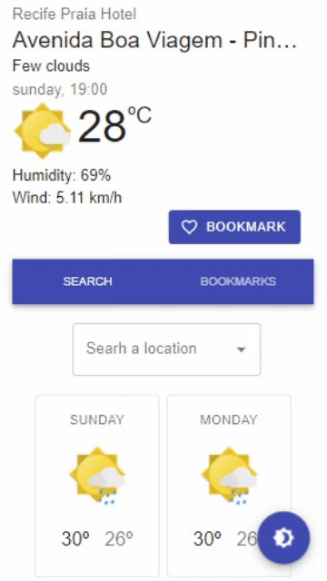
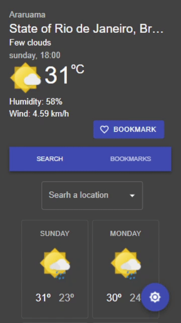

# Search Weather

A single page application to get weather from any location worlwide.

# Usage

Inform your keys at store/keys.ts:
```
export const OPEN_WEATHER_KEY = "YOUR_OPEN_WEATHER_API_KEY";
export const GOOGLE_MAPS_KEY = "YOUR_GOOGLE_MAPS_API_KEY";
```

Just run ```npm install``` and ```npm start``` to use this application on localhost.

# Features
Display the current weather and forecast of the user's location as well as the forecast for the next seven days.
If the user does not grant or ignore permission, location and weather will get by default from Leiria's coordinates.
Users can search for any location, place, city, or country and get and favorite it as a bookmark for later forecast checking!


## Find and favorite your places:


## Supports to dark/light modes:


## Responsitivity to smaller screens:

| Light  | Dark |
| ------------- | ------------- |
|   |  |


## Bibliography:
Locations API by [Google Maps](https://developers.google.com/maps/)

Weather API by [Open Weather](https://openweathermap.org/api)

Material Icons by [prithu](https://twitter.com/prithu524)
