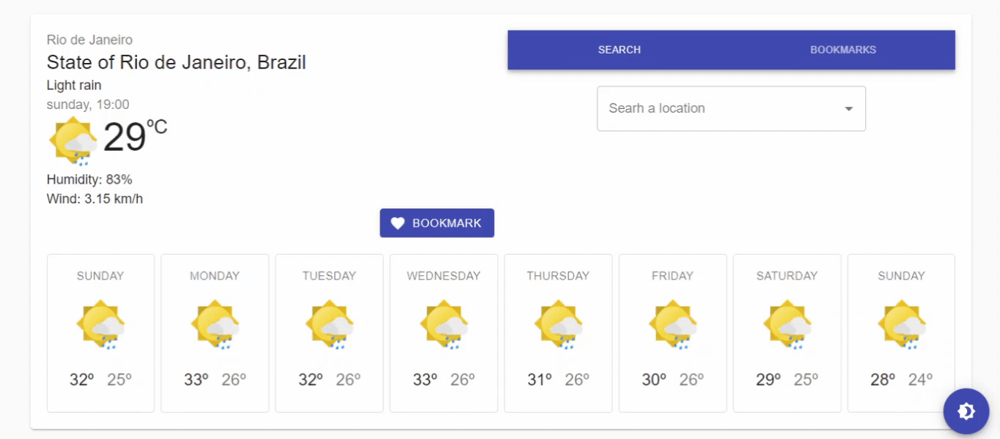
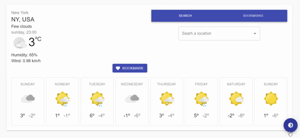

# Search Weather

A single page application to get weather from any location worlwide.

# Usage

Inform your keys at store/keys.ts:
```
export const OPEN_WEATHER_KEY = "YOUR_OPEN_WEATHER_API_KEY";
export const GOOGLE_MAPS_KEY = "YOUR_GOOGLE_MAPS_API_KEY";
```

# Features
Find and favorite your places:


Supports to dark/light modes:


Responsitivity to smaller screens:


## Bibliography:
Locations API by [Google Maps](https://developers.google.com/maps/)

Weather API by [Open Weather](https://openweathermap.org/api)

Material Icons by [prithu](https://twitter.com/prithu524)
